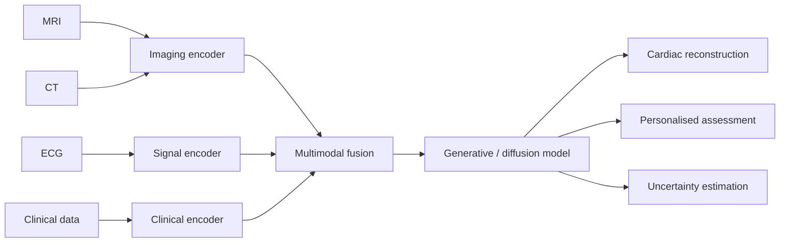

# Multi-modal Understanding of the Human Heart

Research project investigating how imaging and non-imaging cardiac data can be combined with multimodal and generative machine learning to support personalised modelling of heart structure and function.

**Author:** Mernan Jeevaresan  
**Supervisor:** Dr. Chen Chen  
**Institution:** University of Sheffield  
**Project code:** S3.5-COM-CChen2  
**Status:** Research proposal and early-stage development

## Overview

Cardiac assessment normally depends on several complementary sources of information. Magnetic resonance imaging (MRI) and computed tomography (CT) provide detailed anatomical information, while electrocardiograms (ECGs) describe the electrical activity of the heart.

Many computational systems analyse these modalities separately. This can limit their ability to represent the relationships between cardiac anatomy, function and electrical behaviour. The aim of this project is to investigate clinically informed multimodal learning methods that combine these sources and use generative modelling to produce robust, personalised representations of the heart.

## Project aims

The project aims to:

- investigate how MRI, CT and ECG data can contribute complementary cardiac information;
- study early, late and intermediate multimodal fusion strategies;
- learn shared representations across heterogeneous data types;
- explore diffusion-based generative models for cardiac reconstruction;
- improve robustness when clinical data are noisy, incomplete or inconsistent;
- support personalised assessment through models of cardiac structure and function; and
- represent uncertainty in generated or reconstructed outputs.

## Data modalities

| Modality | Type | Information provided |
|---|---|---|
| MRI | Medical imaging | Ventricular volume, wall motion, chamber shape and tissue characteristics |
| CT | Medical imaging | Coronary anatomy, plaque and high-resolution three-dimensional structure |
| ECG | Time-series signal | Electrical conduction, rhythm and indicators of cardiac dysfunction |
| Clinical information | Tabular/contextual data | Demographics, medical history and other patient-specific information, where available |

## Proposed approach

The intended workflow is:

1. **Preprocess each modality** using methods appropriate to its data type.
2. **Learn modality-specific features** from cardiac images, ECG signals and optional clinical variables.
3. **Fuse the learned representations**, with particular interest in intermediate fusion because it can model interactions between modalities while retaining specialised encoders.
4. **Train a generative model**, such as a diffusion model, to reconstruct or generate cardiac structure and function.
5. **Evaluate the model** for reconstruction quality, robustness, clinical consistency and uncertainty.



## Fusion strategies under consideration

### Early fusion

Features from each modality are combined before being passed to a shared model. This can expose cross-modal relationships early, but it may be difficult to align heterogeneous data and handle differences in scale, timing and dimensionality.

### Late fusion

A separate model processes each modality and their predictions are combined near the output. This allows each input type to use a specialised architecture, but it can miss important feature-level relationships between modalities.

### Intermediate fusion

Each modality is first encoded separately, after which the learned representations are combined and processed jointly. This approach may provide a balance between modality-specific learning and cross-modal interaction.

## Research challenges

The project must account for several challenges:

- differences in the structure, scale and resolution of each modality;
- temporal and spatial alignment between imaging and ECG data;
- missing modalities and incomplete patient records;
- noise and inconsistency in real clinical data;
- limited availability of labelled multimodal datasets;
- physiological plausibility of generated cardiac models;
- interpretability and clinical trust; and
- reliable uncertainty estimation.

## Evaluation plan

The final evaluation will depend on the chosen dataset and task. Suitable measures may include:

- image reconstruction metrics such as MAE, MSE, PSNR or SSIM;
- anatomical overlap measures such as Dice score;
- ECG or clinical prediction performance where a supervised task is included;
- comparison of unimodal and multimodal models;
- ablation studies for different fusion strategies;
- performance with missing or corrupted modalities;
- calibration and uncertainty measures; and
- expert or physiological assessment of generated structures.

## Repository structure

The repository is currently centred on the research proposal. A possible structure for the implementation is shown below and can be updated as development progresses.

```text
.
├── README.md
├── Mernan_Dissertation_Report__Copy_.pdf
├── configs/                 # Experiment configurations
├── data/                    # Local dataset directory; do not commit clinical data
├── notebooks/               # Exploration and prototype experiments
├── src/
│   ├── preprocessing/       # MRI, CT, ECG and clinical preprocessing
│   ├── models/              # Modality-specific encoders and generative models
│   ├── fusion/              # Early, intermediate and late fusion modules
│   ├── training/            # Training and validation pipelines
│   └── evaluation/          # Metrics, visualisation and uncertainty analysis
├── results/                 # Generated figures, tables and experiment summaries
├── requirements.txt
└── .gitignore
```

## Getting started

The repository currently documents the proposed research direction. Installation, dataset preparation and training instructions should be added once the implementation and software dependencies have been finalised.

The project report is available here:

[Read the dissertation proposal](Mernan_Dissertation_Report__Copy_.pdf)

## Data governance

Medical data must not be committed directly to the repository. Any clinical dataset used in this project should be anonymised, stored securely and handled according to the relevant ethical approval, licence and institutional data-management requirements.

## Limitations of the current project stage

At this stage, the report presents the motivation, literature survey and intended research direction. It does not yet define a final dataset, complete model architecture, software environment or set of experimental results. These sections of the README should therefore be updated as the implementation develops.

## Licence

No software licence has currently been specified. Until a licence is added, the repository contents should not be assumed to be available for redistribution or reuse.