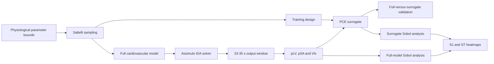

# Uncertainty Quantification of a Compartmental Human Cardiovascular Model

Python implementations of zero-dimensional cardiovascular models, Sobol global sensitivity analysis and Polynomial Chaos Expansion (PCE) surrogate modelling.

**Author:** Mernan Jeevaresan  
**Supervisor:** Dr. Xu Xu  
**Institution:** University of Sheffield, School of Computer Science  
**Degree:** BSc Computer Science  
**Status:** Completed dissertation research prototype

> **Research use only:** this repository is not a medical device and must not be used for diagnosis, treatment or clinical decision-making.

## Overview

Patient-specific cardiovascular models require physiological input parameters that are often uncertain. Running large ensembles of the full model can also become computationally expensive, particularly when global sensitivity analysis requires thousands of evaluations.

This project investigates that problem through four stages:

1. build a zero-dimensional one-chamber cardiovascular model;
2. extend it to a two-chamber model containing the left ventricle and left atrium;
3. apply Saltelli sampling and Sobol sensitivity analysis to identify influential parameters; and
4. construct PCE surrogate models that preserve the sensitivity trends while reducing evaluation time.

The models are formulated as differential-algebraic equation (DAE) systems and solved with the SUNDIALS IDA solver through Assimulo. The principal outputs analysed over the **33-35 second** window are:

- left-ventricular pressure, `pLV`;
- systemic arterial pressure, `pSA`; and
- left-ventricular volume, `Vlv`.

## Project aims

The dissertation set out to:

- develop mechanistic one- and two-chamber cardiovascular models;
- perform global sensitivity analysis on each full model;
- identify influential and non-influential physiological parameters;
- train surrogate models that approximate the full models;
- repeat Sobol analysis using the surrogates; and
- compare full-model and surrogate accuracy, stability and runtime.

## Workflow



## Cardiovascular models

### One-chamber model

The one-chamber model represents the left ventricle, systemic circulation and valve flows using seven state or algebraic variables.

| Variable | Meaning |
|---|---|
| `pLV` | Left-ventricular pressure |
| `pSA` | Systemic arterial pressure |
| `pSV` | Systemic venous pressure |
| `Vlv` | Left-ventricular volume |
| `Qav` | Aortic-valve flow |
| `Qmv` | Mitral-valve flow |
| `Qs` | Systemic flow |

The nine model parameters are:

| Parameter | Description | Baseline value |
|---|---|---:|
| `tau_es` | End-systolic elastance timing | `0.30 s` |
| `tau_ep` | End of elastance relaxation phase | `0.45 s` |
| `Rmv` | Mitral-valve resistance | `0.06` |
| `Zao` | Aortic impedance | `0.033` |
| `Rs` | Systemic resistance | `1.11` |
| `Csa` | Systemic arterial compliance | `1.13` |
| `Csv` | Systemic venous compliance | `11.0` |
| `E_max` | Maximum ventricular elastance | `1.50` |
| `E_min` | Minimum ventricular elastance | `0.03` |

A piecewise Shi-style elastance function represents contraction, relaxation and filling. Valve flow is pressure-driven and one-directional. The baseline implementation also introduces heart-rate variability by sampling successive cardiac-cycle durations from a uniform distribution between `0.4` and `1.1` seconds.

### Two-chamber model

The two-chamber model adds the left atrium and a more detailed systemic circulation. It contains twelve variables:

| Variable | Meaning |
|---|---|
| `Plv` | Left-ventricular pressure |
| `Pla` | Left-atrial pressure |
| `Vlv` | Left-ventricular volume |
| `Vla` | Left-atrial volume |
| `Psas` | Proximal systemic arterial pressure |
| `Qsas` | Proximal systemic arterial flow |
| `Psat` | Systemic arterial trunk pressure |
| `Qsat` | Systemic arterial trunk flow |
| `Psvn` | Systemic venous pressure |
| `Qsvn` | Systemic venous flow |
| `Qav` | Aortic-valve flow |
| `Qmv` | Mitral-valve flow |

Separate time-varying elastance functions are used for the left ventricle and left atrium. The atrial elastance is phase-shifted so that atrial contraction occurs before ventricular systole. The sensitivity study varies 22 parameters covering:

- chamber unstressed volumes;
- minimum and maximum elastance;
- chamber systolic and relaxation timings;
- valve properties;
- vascular resistance;
- arterial and venous compliance; and
- blood-flow inertance.

## Numerical methods

### DAE solution

The models are solved using:

- `Implicit_Problem` from Assimulo;
- the SUNDIALS `IDA` solver;
- absolute and relative tolerances of approximately `1e-6` in the baseline implementation; and
- multiprocessing for independent parameter samples.

### Global sensitivity analysis

SALib is used to generate Saltelli samples and calculate:

- **first-order Sobol indices (`S1`)**, measuring the contribution of an individual parameter; and
- **total-order Sobol indices (`ST`)**, measuring the parameter's contribution including interactions.

Small sample sizes can produce noisy or negative numerical estimates. Larger experiments were therefore used to assess convergence and stability.

### PCE surrogate modelling

OpenTURNS is used to construct Legendre Polynomial Chaos Expansions for uniformly distributed independent inputs.

The implementations use two related strategies:

- `one_chamber_sa.py` uses truncated SVD/POD for time-resolved waveform compression and fits PCEs to the retained coefficients and window-mean outputs;
- `two_chamber_sa.py` fits scalar PCEs directly to the mean `pLV`, `pSA` and `Vlv` outputs.

The number of PCE terms increases quickly with the parameter dimension. For the 22-parameter model, the total-degree basis contains:

| Polynomial degree | Basis terms |
|---:|---:|
| 2 | 276 |
| 3 | 2,300 |
| 4 | 14,950 |
| 5 | 80,730 |

This rapid basis growth is why the two-chamber surrogate uses a lower polynomial degree than the one-chamber sensitivity surrogate.

## Main findings

### Model behaviour

The one-chamber model reproduced the expected inverse pressure-volume relationship during a cardiac cycle: ventricular pressure rises as the chamber contracts and volume falls, followed by pressure reduction and ventricular filling during diastole.

The two-chamber model produced additional atrial detail. Its pressure waveform contains the pre-systolic atrial contribution, while the atrial and ventricular volume curves show the effect of atrial contraction on ventricular preload and stroke volume. The reported waveforms were qualitatively similar to the reference cardiovascular models used for comparison.

### One-chamber sensitivity

Across the 500- and 1,500-sample analyses:

- `E_min` was the dominant parameter for the analysed outputs;
- `Csa`, `tau_ep` and `Rmv` showed moderate effects, particularly for pressure outputs;
- estimates became more stable and physically plausible at the larger sample size; and
- the higher sample count reduced estimator noise but increased full-model runtime.

The one-chamber surrogate preserved the full-model parameter ranking. At 1,500 samples, the reported surrogate result for `Vlv` gave approximately `S1 = 0.69` and `ST = 0.70` for `E_min`, while retaining the moderate influence of `E_max`, `Rs` and `Csa` and the weak influence of `Zao` and `Csv`.

### Two-chamber sensitivity

For the two-chamber model:

- `E_min,lv` and `E_max,lv` were prominent parameters;
- ventricular relaxation timing contributed to `Vlv` and `pLV`;
- `Rmv`, `Rsar` and `Rscp` had smaller but visible effects;
- increasing the analysis from 460 to 9,200 samples suppressed negative/noisy estimates;
- the 9,200- and 23,000-sample analyses produced similar trends, indicating convergence; and
- first- and total-order patterns were close, suggesting relatively weak interaction effects for many parameters under the tested ranges.

### Surrogate accuracy

The PCE waveform approximation closely followed the original one-chamber curves. The surrogate Sobol heatmaps also retained the main full-model sensitivity patterns for both model configurations.

These results concern the parameter ranges and outputs used in this dissertation. They should not be treated as universal physiological parameter rankings.

## Runtime comparison

The final dissertation reported the following benchmark times:

| Model | Samples | Full model | Surrogate | Approx. speed-up |
|---|---:|---:|---:|---:|
| One chamber | 500 | `98.79 s` | `0.35 s` | `282x` |
| One chamber | 1,500 | `285.34 s` | `2.60 s` | `110x` |
| Two chamber | 460 | `311.15 s` | `2.27 s` | `137x` |
| Two chamber | 9,200 | `10,695.88 s` | `13.91 s` | `769x` |
| Two chamber | 23,000 | `34,636.03 s` | `112.66 s` | `307x` |

At 23,000 two-chamber samples, the full analysis took approximately **9.6 hours**, compared with under **2 minutes** for surrogate evaluation.

These timings are the dissertation's recorded experimental results. They are hardware- and configuration-dependent and should not be interpreted as general performance guarantees. Surrogate training still requires evaluations of the full model; the table compares the reported sensitivity-analysis evaluation stages.

## Repository contents

| File | Purpose |
|---|---|
| `oneChamber.py` | Defines, runs and plots the baseline one-chamber cardiovascular model. |
| `one_chamber_sa.py` | Builds the one-chamber POD/PCE surrogate, validates it and performs Sobol analysis. |
| `twoChamber.py` | Defines, runs and plots the baseline two-chamber cardiovascular model. |
| `two_chamber_sa.py` | Builds two-chamber PCE surrogates and compares full and surrogate Sobol indices. |
| `Mernan_Dissertation_Report.pdf` | Final dissertation describing the theory, implementation, results and future work. |
| `sensitivity.txt` | Legacy sensitivity-analysis experiments and development notes; not a maintained entry point. |
| `output.log` | Verbose solver and debugging output from earlier runs. |
| `Xa.h5` | HDF5 development artefact; the four active Python scripts do not load it directly. |
| `results/` | Output directory created by the sensitivity scripts for generated plots. |

## Requirements

The active scripts use:

- Python 3;
- NumPy;
- Matplotlib;
- Assimulo;
- SUNDIALS/IDA;
- SALib;
- OpenTURNS;
- scikit-learn; and
- h5py only when inspecting the supplied HDF5 artefact.

A Conda environment is recommended because Assimulo depends on compiled numerical libraries.

```bash
conda create -n cardio-uq python=3.10
conda activate cardio-uq
conda install -c conda-forge numpy matplotlib scikit-learn h5py openturns salib assimulo
```

Assimulo and SUNDIALS availability depends on the operating system, Python version and Conda channels. A Linux or WSL environment may be easier to configure than native Windows for some installations.

## Running the project

Run all commands from the repository root.

### Baseline one-chamber simulation

```bash
python oneChamber.py
```

This runs the one-chamber DAE model and displays pressure and ventricular-volume plots over the 33-35 second interval.

### One-chamber surrogate and sensitivity analysis

```bash
python one_chamber_sa.py
```

This script:

1. generates Saltelli parameter samples;
2. evaluates the full model in parallel;
3. compresses time-resolved waveforms with truncated SVD;
4. fits the PCE surrogate;
5. compares full and surrogate predictions;
6. computes first- and total-order Sobol indices; and
7. saves validation and sensitivity plots in `results/`.

### Baseline two-chamber simulation

```bash
python twoChamber.py
```

This runs the two-chamber model and displays pressure, volume and flow dynamics.

### Two-chamber surrogate and sensitivity analysis

```bash
python two_chamber_sa.py
```

This evaluates the two-chamber model, fits scalar PCE surrogates for mean `pLV`, `pSA` and `Vlv`, and saves full-model and surrogate Sobol heatmaps.

## Current script settings

The uploaded scripts contain development-scale defaults so the workflow can be tested without immediately reproducing the dissertation's largest experiments.

### `one_chamber_sa.py`

| Setting | Current value | Purpose |
|---|---:|---|
| `DT_MODEL` | `0.02 s` | Full-model output interval |
| `WIN` | `(33.0, 35.0) s` | Analysed time window |
| `DT_SLICE` | `0.02 s` | Surrogate waveform interval |
| `PCE_DEGREE` | `5` | Maximum total polynomial degree |
| `N_TRAIN` | `5` | Saltelli base size for training |
| `N_VAL` | `5` | Saltelli base size for validation/Sobol analysis |
| `ENERGY_KEEP` | `0.99` | Variance retained by the SVD basis |
| `N_CORES` | CPU count minus one | Parallel worker count |

### `two_chamber_sa.py`

| Setting | Current value | Purpose |
|---|---:|---|
| `DT` | `0.002 s` | Integrator output interval |
| `WIN` | `(33.0, 35.0) s` | Analysed time window |
| `PCE_DEGREE` | `3` | Maximum total polynomial degree |
| `N_TRAIN` | `10` | Saltelli base size for training |
| `N_SOBOL` | `10` | Saltelli base size for Sobol evaluation |
| `N_CORES` | CPU count minus one | Parallel worker count |

The dissertation benchmarks used much larger evaluation sets: 500 and 1,500 samples for the one-chamber comparison, and 460, 9,200 and 23,000 samples for the two-chamber comparison.

## Generated figures

`one_chamber_sa.py` can create files such as:

```text
results/
├── parity_pLV_<N>.png
├── parity_pSA_<N>.png
├── parity_Vlv_<N>.png
├── heatmap_full_<N>.png
├── heatmap_sur_<N>.png
├── Figure_left_ventricle_<N>.png
└── Figure_left_ventricle_2_<N>.png
```

`two_chamber_sa.py` can create:

```text
results/
├── 2_heat_full_<N>.png
└── 2_heat_sur_<N>.png
```

`<N>` denotes the generated evaluation-set size used by the script.

## Reproducibility

The sensitivity scripts set:

```python
np.random.seed(2025)
```

The baseline `oneChamber.py` script does not set a fixed seed, so its heart-rate sequence can differ between runs. Runtime and sensitivity estimates also depend on:

- solver tolerances;
- output resolution;
- parameter bounds;
- sample size;
- polynomial degree;
- failed-simulation handling; and
- the number of CPU workers.

## Limitations

- Zero-dimensional models describe global pressure, volume and flow behaviour but do not resolve spatial blood-flow patterns.
- The results were validated qualitatively against published waveform shapes rather than patient-specific clinical measurements.
- Sobol estimates at small sample sizes can be noisy, unstable or slightly negative because of estimator error.
- PCE assumes the selected input distributions and independence structure; real physiological parameters may be correlated.
- Polynomial basis size grows rapidly with parameter count and degree, making high-order two-chamber PCE expensive to train.
- The two-chamber `v0_lv` and `v0_la` uncertainty bounds are `10.000-10.001 ml`, so those parameters are effectively fixed in the reported analysis.
- Failed or non-physical simulations are not handled uniformly across every development script.
- `sensitivity.txt` contains older, partly commented implementations and should not be treated as the maintained analysis pipeline.
- The project has not undergone clinical validation or regulatory assessment.

## Future work

The dissertation identifies several extensions:

- expand the model from one and two chambers to a four-chamber cardiovascular model;
- compare Sobol analysis with Morris, local sensitivity and eFAST methods;
- evaluate the trade-off between sensitivity accuracy and computational cost;
- compare PCE with Kriging, neural-network and Bayesian-regression surrogates;
- add quantitative surrogate validation metrics and uncertainty intervals;
- improve handling of failed or non-physiological parameter samples; and
- validate the model using patient-specific or clinical measurements.

## Version control

Generated results, local environments and large logs should normally be excluded from Git:

```gitignore
__pycache__/
*.py[cod]
.venv/
env/
results/
*.log
```

Review large HDF5 files before committing them. Do not commit confidential or identifiable clinical data.

## Dissertation

The full methodology, literature review, equations, experimental figures and discussion are available in:

```text
Mernan_Dissertation_Report.pdf
```

## Licence

No software licence is currently specified. Until a licence is added, the repository should not be assumed to permit redistribution or reuse.
